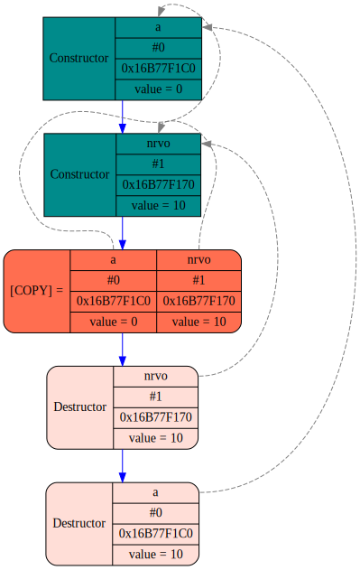
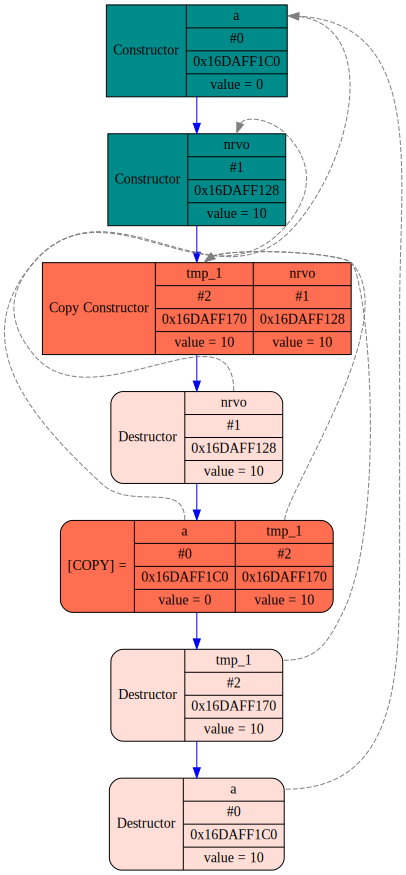
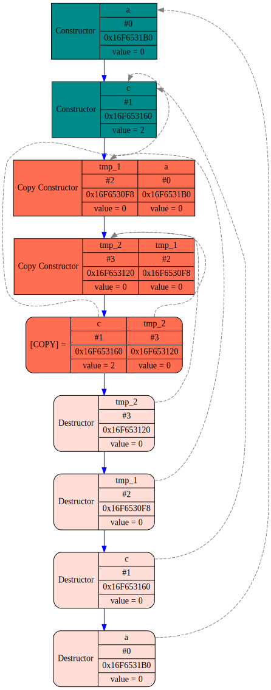
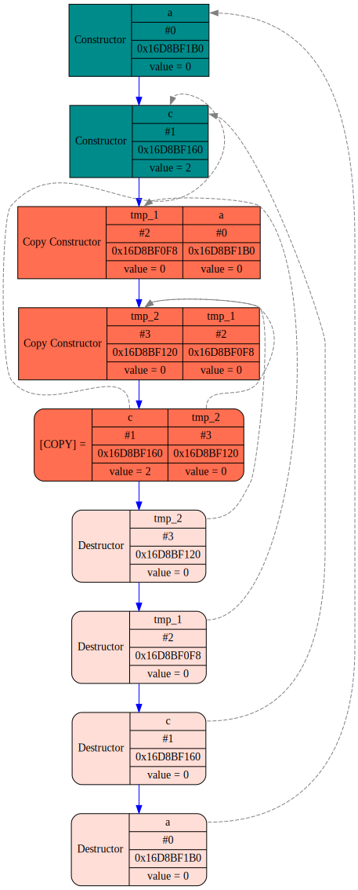
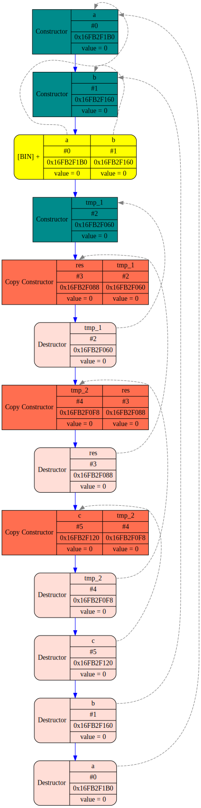
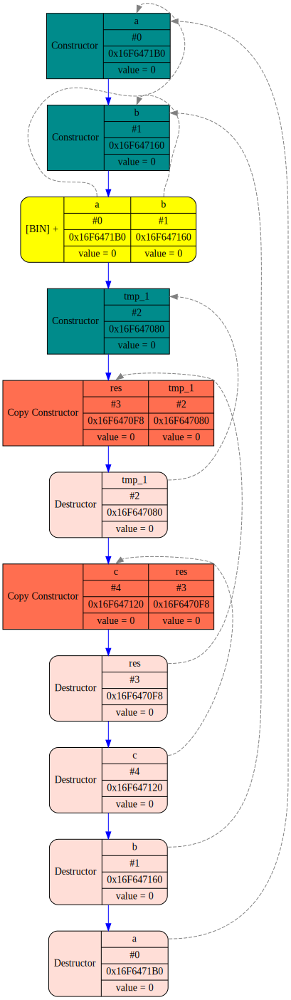
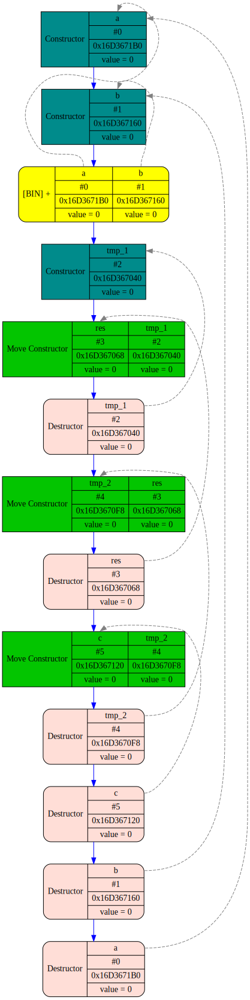
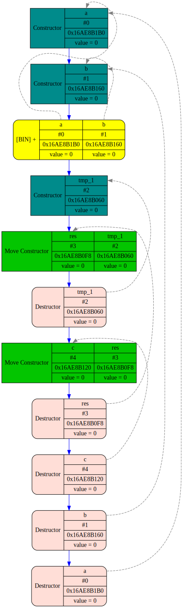

# Copy Elision and Move Semantics

## Copy Elision NRVO

```c++
TrackingInt NRVO(){
    FUNCTION_TMP
    VAR(int, nrvo, 10);
    return nrvo;
}

void Test1(){
    FUNCTION_TMP
    VAR(int, a, 0);
    a = NRVO();
}

```


|            | Without Move                  |
| ------------ | ------------------------------- |
| Without CE | Copies = 2<br/> Temp objs = 1 |
| With CE    | Copies = 1<br/> Temp objs = 0 |


|                  | Without Copy Elision                                 | With Copy Elision                                  |
| ------------------ | ------------------------------------------------------ | ---------------------------------------------------- |
| **Without Move** |  |  |

## Copy Elision NRVO not working

```c++
TrackingInt NoNRVO(TrackingInt val){
    FUNCTION_TMP
    return val;
}

void Test2(){
    FUNCTION_TMP
    VAR(int, a, 0);
    VAR(int, c, 2);
    c = NoNRVO(a);
}
```


|                  | Without Copy Elision                                 | With Copy Elision                                 |
| ------------------ | ------------------------------------------------------ | --------------------------------------------------- |
| **Without Move** |  |  |

## Move Semantics

```c++
TrackingInt Sum2(TrackingInt &val1, TrackingInt &val2){
    FUNCTION_TMP
    VAR(int, res, val1 + val2);
    return res;
}

void Test4(){
    FUNCTION_TMP
    VAR(int, a, 0);
    VAR(int, b, 0);
    VAR(int, c, Sum2(a, b));
}

```

<details>
<summary>Log -Copy Elision -Move</summary>
<pre>
int main() {<br>
	void Test4() {
		<font color = Blue>Constructor </font><font color = CadetBlue>a</font><font color = Black>[#0](0x16FB2F1B0)</font><font color = DarkOliveGreen><value=0></font>
		<font color = Blue>Constructor </font><font color = CadetBlue>b</font><font color = Black>[#1](0x16FB2F160)</font><font color = DarkOliveGreen><value=0></font><br>
		TrackingInt Sum2(TrackingInt &, TrackingInt &) {
			<b><font color = DarkGoldenrod>[BIN] </font></b><font color = CadetBlue>a</font><font color = Black>[#0](0x16FB2F1B0)</font><font color = DarkOliveGreen><value=0></font><font color = DarkBlue> + </font><font color = CadetBlue>b</font><font color = Black>[#1](0x16FB2F160)</font><font color = DarkOliveGreen><value=0></font>
			<font color = Blue>Constructor </font><font color = CadetBlue>tmp_1</font><font color = Black>[#2](0x16FB2F060)</font><font color = DarkOliveGreen><value=0></font>
			<b><font color = DarkRed>[COPY] </font></b><font color = Blue>Constructor </font><font color = CadetBlue>res</font><font color = Black>[#3](0x16FB2F088)</font><font color = DarkOliveGreen><value=0></font><font color = Blue> form </font><font color = CadetBlue>tmp_1</font><font color = Black>[#2](0x16FB2F060)</font><font color = DarkOliveGreen><value=0></font>
			<font color = FireBrick>Destructor </font><font color = CadetBlue>tmp_1</font><font color = Black>[#2](0x16FB2F060)</font><font color = DarkOliveGreen><value=0></font>
			<b><font color = DarkRed>[COPY] </font></b><font color = Blue>Constructor </font><font color = CadetBlue>tmp_2</font><font color = Black>[#4](0x16FB2F0F8)</font><font color = DarkOliveGreen><value=0></font><font color = Blue> form </font><font color = CadetBlue>res</font><font color = Black>[#3](0x16FB2F088)</font><font color = DarkOliveGreen><value=0></font>
			<font color = FireBrick>Destructor </font><font color = CadetBlue>res</font><font color = Black>[#3](0x16FB2F088)</font><font color = DarkOliveGreen><value=0></font>
		}
		<b><font color = DarkRed>[COPY] </font></b><font color = Blue>Constructor </font><font color = CadetBlue>c</font><font color = Black>[#5](0x16FB2F120)</font><font color = DarkOliveGreen><value=0></font><font color = Blue> form </font><font color = CadetBlue>tmp_2</font><font color = Black>[#4](0x16FB2F0F8)</font><font color = DarkOliveGreen><value=0></font>
		<font color = FireBrick>Destructor </font><font color = CadetBlue>tmp_2</font><font color = Black>[#4](0x16FB2F0F8)</font><font color = DarkOliveGreen><value=0></font>
		<font color = FireBrick>Destructor </font><font color = CadetBlue>c</font><font color = Black>[#5](0x16FB2F120)</font><font color = DarkOliveGreen><value=0></font>
		<font color = FireBrick>Destructor </font><font color = CadetBlue>b</font><font color = Black>[#1](0x16FB2F160)</font><font color = DarkOliveGreen><value=0></font>
		<font color = FireBrick>Destructor </font><font color = CadetBlue>a</font><font color = Black>[#0](0x16FB2F1B0)</font><font color = DarkOliveGreen><value=0></font>
	}
}

<font color = DimGray>Copy count = 3<br></font><font color = DimGray>Move count = 0<br></font><font color = DimGray>Temporary objects count = 2</font>

</pre>
</details>


<details>
<summary>Log +Copy Elision -Move</summary>
<pre>
int main() {<br>
	void Test4() {
		<font color = Blue>Constructor </font><font color = CadetBlue>a</font><font color = Black>[#0](0x16F6471B0)</font><font color = DarkOliveGreen><value=0></font>
		<font color = Blue>Constructor </font><font color = CadetBlue>b</font><font color = Black>[#1](0x16F647160)</font><font color = DarkOliveGreen><value=0></font><br>
		TrackingInt Sum2(TrackingInt &, TrackingInt &) {
			<b><font color = DarkGoldenrod>[BIN] </font></b><font color = CadetBlue>a</font><font color = Black>[#0](0x16F6471B0)</font><font color = DarkOliveGreen><value=0></font><font color = DarkBlue> + </font><font color = CadetBlue>b</font><font color = Black>[#1](0x16F647160)</font><font color = DarkOliveGreen><value=0></font>
			<font color = Blue>Constructor </font><font color = CadetBlue>tmp_1</font><font color = Black>[#2](0x16F647080)</font><font color = DarkOliveGreen><value=0></font>
			<b><font color = DarkRed>[COPY] </font></b><font color = Blue>Constructor </font><font color = CadetBlue>res</font><font color = Black>[#3](0x16F6470F8)</font><font color = DarkOliveGreen><value=0></font><font color = Blue> form </font><font color = CadetBlue>tmp_1</font><font color = Black>[#2](0x16F647080)</font><font color = DarkOliveGreen><value=0></font>
			<font color = FireBrick>Destructor </font><font color = CadetBlue>tmp_1</font><font color = Black>[#2](0x16F647080)</font><font color = DarkOliveGreen><value=0></font>
		}
		<b><font color = DarkRed>[COPY] </font></b><font color = Blue>Constructor </font><font color = CadetBlue>c</font><font color = Black>[#4](0x16F647120)</font><font color = DarkOliveGreen><value=0></font><font color = Blue> form </font><font color = CadetBlue>res</font><font color = Black>[#3](0x16F6470F8)</font><font color = DarkOliveGreen><value=0></font>
		<font color = FireBrick>Destructor </font><font color = CadetBlue>res</font><font color = Black>[#3](0x16F6470F8)</font><font color = DarkOliveGreen><value=0></font>
		<font color = FireBrick>Destructor </font><font color = CadetBlue>c</font><font color = Black>[#4](0x16F647120)</font><font color = DarkOliveGreen><value=0></font>
		<font color = FireBrick>Destructor </font><font color = CadetBlue>b</font><font color = Black>[#1](0x16F647160)</font><font color = DarkOliveGreen><value=0></font>
		<font color = FireBrick>Destructor </font><font color = CadetBlue>a</font><font color = Black>[#0](0x16F6471B0)</font><font color = DarkOliveGreen><value=0></font>
	}
}

<font color = DimGray>Copy count = 2<br></font><font color = DimGray>Move count = 0<br></font><font color = DimGray>Temporary objects count = 1</font>

</pre>
</details>


<details>

<summary>Log -Copy Elision +Move</summary>
<pre>
int main() {<br>
	void Test4() {
		<font color = Blue>Constructor </font><font color = CadetBlue>a</font><font color = Black>[#0](0x16D3671B0)</font><font color = DarkOliveGreen><value=0></font>
		<font color = Blue>Constructor </font><font color = CadetBlue>b</font><font color = Black>[#1](0x16D367160)</font><font color = DarkOliveGreen><value=0></font><br>
		TrackingInt Sum2(TrackingInt &, TrackingInt &) {
			<b><font color = DarkGoldenrod>[BIN] </font></b><font color = CadetBlue>a</font><font color = Black>[#0](0x16D3671B0)</font><font color = DarkOliveGreen><value=0></font><font color = DarkBlue> + </font><font color = CadetBlue>b</font><font color = Black>[#1](0x16D367160)</font><font color = DarkOliveGreen><value=0></font>
			<font color = Blue>Constructor </font><font color = CadetBlue>tmp_1</font><font color = Black>[#2](0x16D367040)</font><font color = DarkOliveGreen><value=0></font>
			<b><font color = DarkGreen>[MOVE] </font></b><font color = Blue>Constructor </font><font color = CadetBlue>res</font><font color = Black>[#3](0x16D367068)</font><font color = DarkOliveGreen><value=0></font><font color = Blue> form </font><font color = CadetBlue>tmp_1</font><font color = Black>[#2](0x16D367040)</font><font color = DarkOliveGreen><value=0></font>
			<font color = FireBrick>Destructor </font><font color = CadetBlue>tmp_1</font><font color = Black>[#2](0x16D367040)</font><font color = DarkOliveGreen><value=0></font>
			<b><font color = DarkGreen>[MOVE] </font></b><font color = Blue>Constructor </font><font color = CadetBlue>tmp_2</font><font color = Black>[#4](0x16D3670F8)</font><font color = DarkOliveGreen><value=0></font><font color = Blue> form </font><font color = CadetBlue>res</font><font color = Black>[#3](0x16D367068)</font><font color = DarkOliveGreen><value=0></font>
			<font color = FireBrick>Destructor </font><font color = CadetBlue>res</font><font color = Black>[#3](0x16D367068)</font><font color = DarkOliveGreen><value=0></font>
		}
		<b><font color = DarkGreen>[MOVE] </font></b><font color = Blue>Constructor </font><font color = CadetBlue>c</font><font color = Black>[#5](0x16D367120)</font><font color = DarkOliveGreen><value=0></font><font color = Blue> form </font><font color = CadetBlue>tmp_2</font><font color = Black>[#4](0x16D3670F8)</font><font color = DarkOliveGreen><value=0></font>
		<font color = FireBrick>Destructor </font><font color = CadetBlue>tmp_2</font><font color = Black>[#4](0x16D3670F8)</font><font color = DarkOliveGreen><value=0></font>
		<font color = FireBrick>Destructor </font><font color = CadetBlue>c</font><font color = Black>[#5](0x16D367120)</font><font color = DarkOliveGreen><value=0></font>
		<font color = FireBrick>Destructor </font><font color = CadetBlue>b</font><font color = Black>[#1](0x16D367160)</font><font color = DarkOliveGreen><value=0></font>
		<font color = FireBrick>Destructor </font><font color = CadetBlue>a</font><font color = Black>[#0](0x16D3671B0)</font><font color = DarkOliveGreen><value=0></font>
	}
}

<font color = DimGray>Copy count = 0<br></font><font color = DimGray>Move count = 3<br></font><font color = DimGray>Temporary objects count = 2</font>

</pre>
</details>


<details>
<summary>Log +Copy Elision +Move</summary>
<pre>
int main() {<br>
	void Test4() {
		<font color = Blue>Constructor </font><font color = CadetBlue>a</font><font color = Black>[#0](0x16D1471B0)</font><font color = DarkOliveGreen><value=0></font>
		<font color = Blue>Constructor </font><font color = CadetBlue>b</font><font color = Black>[#1](0x16D147160)</font><font color = DarkOliveGreen><value=0></font><br>
		TrackingInt Sum2(TrackingInt &, TrackingInt &) {
			<b><font color = DarkGoldenrod>[BIN] </font></b><font color = CadetBlue>a</font><font color = Black>[#0](0x16D1471B0)</font><font color = DarkOliveGreen><value=0></font><font color = DarkBlue> + </font><font color = CadetBlue>b</font><font color = Black>[#1](0x16D147160)</font><font color = DarkOliveGreen><value=0></font>
			<font color = Blue>Constructor </font><font color = CadetBlue>tmp_1</font><font color = Black>[#2](0x16D147060)</font><font color = DarkOliveGreen><value=0></font>
			<b><font color = DarkGreen>[MOVE] </font></b><font color = Blue>Constructor </font><font color = CadetBlue>res</font><font color = Black>[#3](0x16D1470F8)</font><font color = DarkOliveGreen><value=0></font><font color = Blue> form </font><font color = CadetBlue>tmp_1</font><font color = Black>[#2](0x16D147060)</font><font color = DarkOliveGreen><value=0></font>
			<font color = FireBrick>Destructor </font><font color = CadetBlue>tmp_1</font><font color = Black>[#2](0x16D147060)</font><font color = DarkOliveGreen><value=0></font>
		}
		<b><font color = DarkGreen>[MOVE] </font></b><font color = Blue>Constructor </font><font color = CadetBlue>c</font><font color = Black>[#4](0x16D147120)</font><font color = DarkOliveGreen><value=0></font><font color = Blue> form </font><font color = CadetBlue>res</font><font color = Black>[#3](0x16D1470F8)</font><font color = DarkOliveGreen><value=0></font>
		<font color = FireBrick>Destructor </font><font color = CadetBlue>res</font><font color = Black>[#3](0x16D1470F8)</font><font color = DarkOliveGreen><value=0></font>
		<font color = FireBrick>Destructor </font><font color = CadetBlue>c</font><font color = Black>[#4](0x16D147120)</font><font color = DarkOliveGreen><value=0></font>
		<font color = FireBrick>Destructor </font><font color = CadetBlue>b</font><font color = Black>[#1](0x16D147160)</font><font color = DarkOliveGreen><value=0></font>
		<font color = FireBrick>Destructor </font><font color = CadetBlue>a</font><font color = Black>[#0](0x16D1471B0)</font><font color = DarkOliveGreen><value=0></font>
	}
}

<font color = DimGray>Copy count = 0<br></font><font color = DimGray>Move count = 2<br></font><font color = DimGray>Temporary objects count = 1</font>
</pre>

</details>


|                          | Without Move                                 | With Move                                    |
| -------------------------- | ---------------------------------------------- | ---------------------------------------------- |
| **Without Copy Elision** | Copies = 3<br/> Moves = 0<br/> Temp objs = 2 | Copies = 0<br/> Moves = 3<br/> Temp objs = 2 |
| **With Copy Elision**    | Copies = 2<br/> Moves = 0<br/> Temp objs = 1 | Copies = 0<br/> Moves = 2<br/> Temp objs = 1 |


|                  | Without Copy Elision                                     | With Copy Elision                                       |
| ------------------ | ---------------------------------------------------------- | --------------------------------------------------------- |
| **Without Move** |  |  |
| **With Move**    |   |   |

Compare the same graphs in another order.


|                          | Without Move                                             | With Move                                               |
| -------------------------- | ---------------------------------------------------------- | --------------------------------------------------------- |
| **Without Copy Elision** |  |  |
| **With Copy Elision**    |   |   |

##Conclusion
Use **NRVO** to avoid unnecessary copying, but do it carefully and close to the standard.<br>
Use **move semantics** to turn copying into moves.
